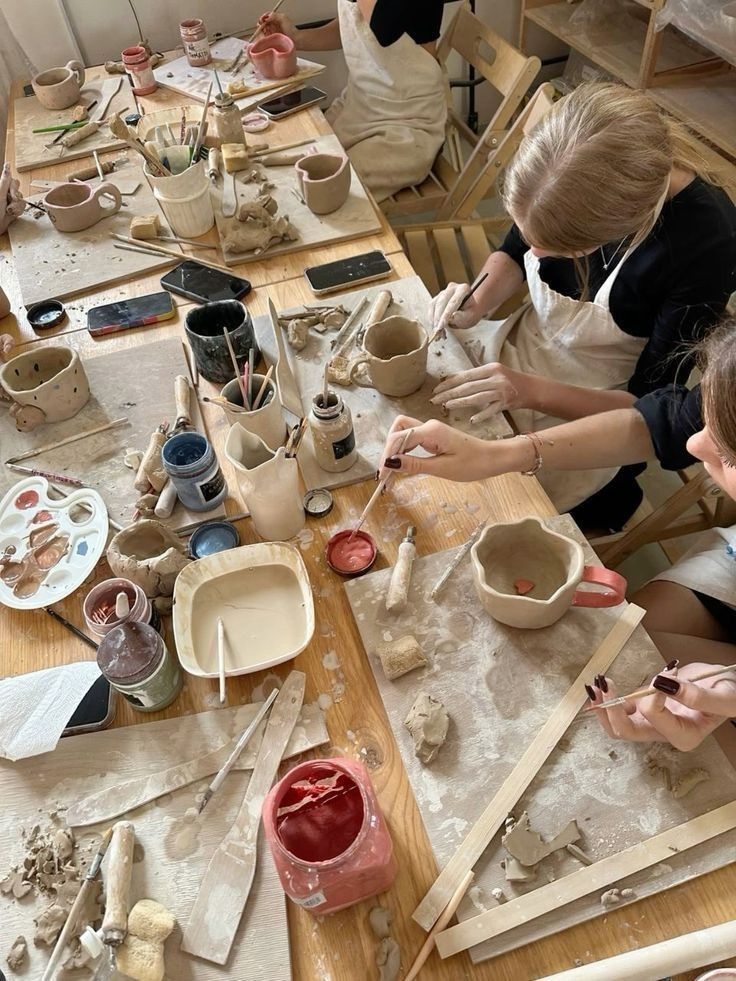

# Eventi PHA

Spazi di ascolto, workshop e incontri dedicati al benessere psicologico universitario.

## Eventi passati

### Ansia da esame

📅 14 Maggio 2026  
📍 Aula Studio B

Strategie pratiche per affrontare la sessione senza burnout.

[Partecipa](#){.event-button}

### Mindfulness per studenti

📅 20 Maggio 2026  
📍 Online

Un laboratorio esperienziale per rallentare e ritrovare concentrazione.

[Partecipa](#){.event-button}

### Mindfulness per studenti

📅 20 Maggio 2026  
📍 Online

Un laboratorio esperienziale per rallentare e ritrovare concentrazione.

[Partecipa](#){.event-button}

### Laboratorio di ceramica

📅 24 Aprile 2026  
📍 Aula AMU

Il laboratorio tratterà il tema della prevenzione delle infezioni sessualmente trasmissibili e delle gravidanze indesiderate e sarà facilitato dalla dott.ssa Cristina Audino, psicologa e consulente sessuale per "Medici del mondo Italia" ed esperta nella lavorazione della ceramica. 

[Partecipa](https://forms.gle/YaAeNSMfFDM6Leu36){.event-button}

